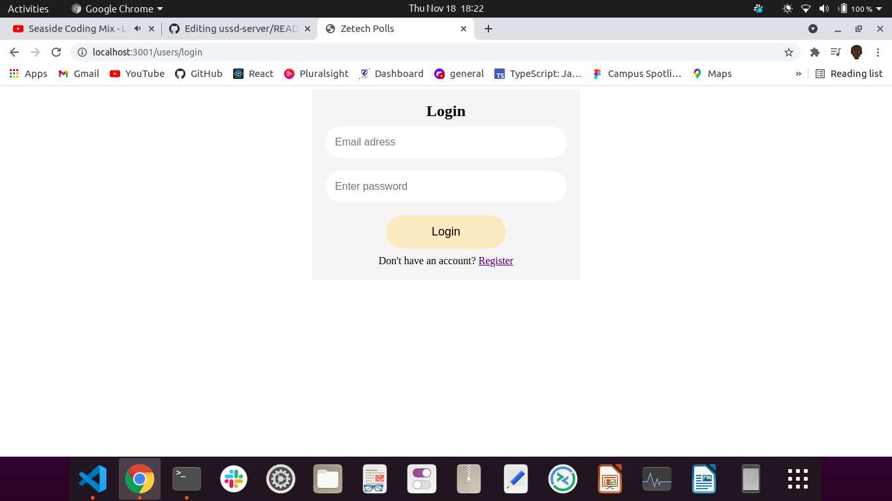

# E-voting-system
This is an online zetech voting system 
This is a campus based online voting system used by students to vote for their required leader and see a real time system.
## Table of Contents
- [E-voting-system](#E-voting-system)
  - [Table of Contents](#table-of-contents)
  - [Problem Statement](#problem-statement)
  - [Objectives](#objectives)
  - [Users](#users)
  - [Technologies](#technologies)
  - [ Run website](#Run website)
  - [REQUIREMENTS SPECIFICATION](#requirements-specification)
    - [Technical Requirements](#technical-requirements)
    - [Non-functional requirements](#non-functional-requirements)
    - [Functional Requirements](#functional-requirements)
      - [Users Module](#users-module)
      - [E-voting-system-log in system](#E-voting-system-log in system)
      - [pages module](#pages-module)
  - [Software Design Description](#software-design-description)
    - [User Interface Design](#user-interface-design)
      - [Login Page](#login-page)
      - [Registration Page](#registration-page)
      - [campaign Page](#campaign-page)
      - [voting Page](#voting-page)
    - [Database package](#database-package)
      - [Users Table](#users-table)
      - [votes-Table](#votes-table)

## Problem Statement
An E-voting system that allows student to register,follow campaigns,commenting and voting their learders in. This will reduce time wastage ,and it will increase transparency to voters because its a real time voting system. Currently students vote using a voting website that is shared by a number of university and its not transparent and it doesn't allow the votes to know their leaders batter.This will reduce the rate of cheating among the students during the voting time.

## Objectives
The main objective of this project is to create an E-voting system  web based application. This can broken down into:
1. To create a users management module that will allow registration of students for voting purposes,login.
2. To create a  system that will allow users to follow along in the campaing.
3. To create an voting system log in system  that will allow users to votes and campaign.
4. To create a real time project that when someone votes can see they voted for.

## Users
1. campus students
2. System administrators.

## Technologies
The system we build on JAM stack with the following technologies
- Javascript
-EJS
- HTML,SCSS
- MONGO DB

## Run Website
To run this website
1. clone the repository to your local machine.
```#!/bin/bash
git clone <url>
```
2. install dependancies
```#!/bin/bash
npm install
```
3. run the app
```#!/bin/bash
npm start
```

## REQUIREMENTS SPECIFICATION

### Technical Requirements
You need to use a phone or laptop to access the website.

### Non-functional requirements
- Data should be encrypted.
- The system should be light weight for ease of access and should within two seconds.
- Should be responsive to different screen sizes.

### Functional Requirements

#### Users Module
- Registration
- login
- Password

#### campaing module
- log in
- upload your campaign

#### voting module
- you just get in to the page and vote 


## Software Design Description


### User Interface Design


#### Landing Page
The landing page is expected to look as shown below.


#### Login Page

The Login Page Design:


#### Registration Page

The sign up design:

#### Campaign page


### Voting page


#### Users Table
- Id - This will be auto increment which will the unique identifier for the user
- email - This will be a school email
- name first name and second name - User given name
- password - should be atleast 6 characters

#### vote Table
- id
- person voted for
- voter id
